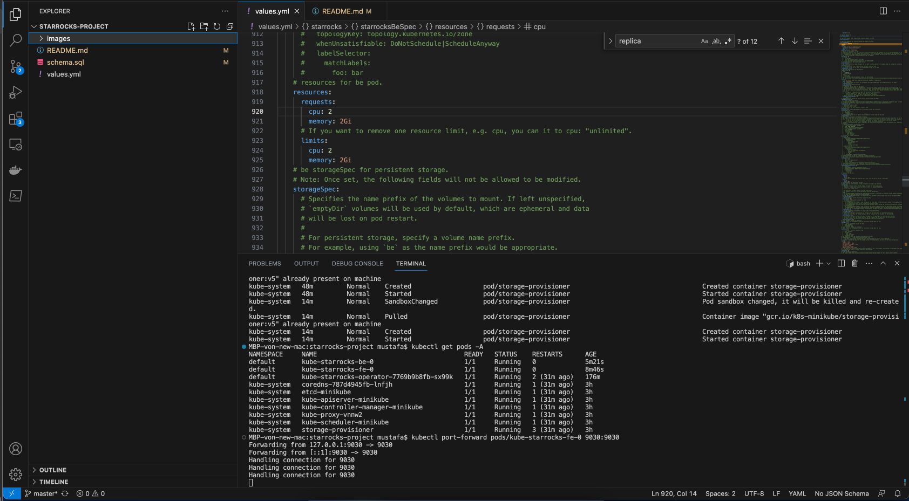

**⚠️ Warning: If you need to expose multiple ports simultaneously (e.g., port 8030 for StarRocks and another port for Grafana), consider using Docker Compose instead of Kubernetes for easier port management. `kubectl expose pod testing-pod — port=80 — type=NodePort` **


**⚠️ Warning: Configurations for StarRocks Frontend/Backend could better be loaded from external files, but that requires forking the main chart, since Helm functions work only inside chart and not values files. https://helm.sh/docs/chart_template_guide/accessing_files/ **

## Screenshots

### Screenshot 4


### Screenshot 3


### Screenshot 5


### Screenshot 1


### Screenshot 2


# StarRocks Setup

```
minikube start --memory 7854 --cpus=4 --driver=docker

minikube config set cpus 4
minikube config set memory 7854

helm repo add starrocks https://starrocks.github.io/starrocks-kubernetes-operator
helm repo update

helm install -f /Users/mustafa/Documents/starrocks-project/starrocks/values.yml starrocks starrocks/kube-starrocks

helm upgrade --install -f  /Users/mustafa/Documents/starrocks-project/starrocks/values.yml starrocks starrocks/kube-starrocks

kubectl --namespace default get starrockscluster -l "cluster=kube-starrocks"

kubectl port-forward pods/kube-starrocks-fe-0 9030:9030
```

# StarRocks Node Ports

```
kubectl expose service kube-starrocks-fe-service --port=9030 --target-port=9030 --type=NodePort
kubectl expose service kube-starrocks-fe-service --port=8030 --target-port=8030 --type=NodePort
```

# StarRocks Links

- https://github.com/StarRocks/starrocks-kubernetes-operator/blob/main/doc/local_installation_how_to.md
- https://github.com/StarRocks/starrocks-kubernetes-operator/tree/main/examples/starrocks
- https://github.com/StarRocks/starrocks-kubernetes-operator/tree/main/doc
- https://docs.starrocks.io/docs/deployment/helm/
- https://github.com/StarRocks/starrocks-kubernetes-operator/blob/main/helm-charts/charts/kube-starrocks/values.yaml
- https://artifacthub.io/packages/helm/kube-starrocks/kube-starrocks?modal=values
- https://github.com/StarRocks/starrocks-kubernetes-operator

# Superset Setup

```
helm repo add superset https://apache.github.io/superset
helm search repo superset
helm upgrade --install --values /Users/mustafa/Documents/starrocks-project/superset/values.yml superset superset/superset

kubectl port-forward service/superset 8088:8088 --namespace default

helm uninstall superset
```

Add StarRocks Connection:

```
kube-starrocks-fe-service:8030
```

# Superset Init Container

In a production cluster, you would not use hostPath. Instead a cluster administrator would provision a network resource like a Google Compute Engine persistent disk, an NFS share, or an Amazon Elastic Block Store volume. Cluster administrators can also use StorageClasses to set up dynamic provisioning.

Another possibility is to mount the resources directly with a host mount path to the superset volumes
Separation for future extensibility to add a kubernetes operator and for illustrative prototype purpose
Separation for ease of testing without messing around with the Superset helm chart
The question is how do you get the resources dats folder mounted on the prod cluster? via Flux?

```
minikube ssh
sudo mkdir /mnt/data
sudo sh -c "echo 'Hello from Kubernetes storage' > /mnt/data/index.html"
cat /mnt/data/index.html

echo $(minikube ip)

minikube cp /Users/mustafa/Documents/starrocks-project/superset-initialization/config.zip /mnt/src/config.zip

helm install superset-init-job ./superset-initialization
helm uninstall superset-init-job
```

Then, mount the extra volume where the resources/dashboards are located

```
extraVolumes:
  - name: data-pvc
    persistentVolumeClaim:
      claimName: data-pvc

extraVolumeMounts:
  - name: data-pv
    mountPath: /mnt/config
    readOnly: true
```

Then, load the dashboards from the volume into superset with init script

```
  # -- A Superset init script
  # @default -- a script to create admin user and initialize roles
  initscript: |-
```

# Superset Links

* https://superset.apache.org/docs/installation/kubernetes/
* https://github.com/apache/superset/blob/master/helm/superset/values.yaml
* https://kubernetes.io/docs/tasks/configure-pod-container/configure-persistent-volume-storage/
* https://superset.apache.org/docs/configuration/importing-exporting-datasources/

# S3 Proxy

´´´
helm repo add radar-base https://radar-base.github.io/radar-helm-charts
helm install -f /Users/mustafa/Documents/starrocks-project/s3-proxy-values.yml my-s3-proxy radar-base/s3-proxy --version 0.4.2
´´´

# Known Issues

## Redis Dependency

```
default     90s         Warning   BackOff                 pod/superset-worker-6f9d99c6cf-h2557               Back-off restarting failed container wait-for-postgres-redis in pod superset-worker-6f9d99c6cf-h2557_default(b8071b4c-aac5-423d-8aab-e4627e356d98)
```

```
  initContainers:
    - name: wait-for-postgres-redis
      image: "{{ .Values.initImage.repository }}:{{ .Values.initImage.tag }}"
      imagePullPolicy: "{{ .Values.initImage.pullPolicy }}"
      envFrom:
        - secretRef:
            name: "{{ tpl .Values.envFromSecret . }}"
      command:
        - /bin/sh
        - -c
        - dockerize -wait "tcp://$DB_HOST:$DB_PORT" -wait "tcp://$REDIS_HOST:$REDIS_PORT" -timeout 120s
```

Solution: Remove `-wait "tcp://$REDIS_HOST:$REDIS_PORT"`
Eventually: Removed all references to redis

## Celery Dependency
```
    Liveness:  exec [sh -c celery -A superset.tasks.celery_app:app inspect ping -d celery@$HOSTNAME] delay=120s timeout=60s period=60s #success=1 #failure=3
```

```
  Warning  BackOff    71s (x52 over 15m)  kubelet            Back-off restarting failed container superset in pod superset-worker-8485dd5db7-bwxdn_default(385178e7-8933-4f65-b1ba-f03b4f123208)
```

```
  superset:
    Container ID:  docker://62c368fd3ca4d997917dd1485e0c08cccb948ab05fe2c0d85b5b1d1d9212f809
    Image:         apachesuperset.docker.scarf.sh/apache/superset:4.0.1
    Image ID:      docker-pullable://apachesuperset.docker.scarf.sh/apache/superset@sha256:ab9467fd712cbe3738d1a7d574d6230c0b04a88af5e5e11f3fbc38e2af305162
    Port:          <none>
    Host Port:     <none>
    Command:
      /bin/sh
      -c
      . /app/pythonpath/superset_bootstrap.sh; celery --app=superset.tasks.celery_app:app worker
```

Solution: Add celery beat

## Superset Secret

```
$ kubectl logs -f  pods/superset-celerybeat-7d68859955-j9pk5

Defaulted container "superset-celerybeat" out of: superset-celerybeat, wait-for-postgres (init)
--------------------------------------------------------------------------------
                                    WARNING
--------------------------------------------------------------------------------
A Default SECRET_KEY was detected, please use superset_config.py to override it.
Use a strong complex alphanumeric string and use a tool to help you generate 
a sufficiently random sequence, ex: openssl rand -base64 42
--------------------------------------------------------------------------------
--------------------------------------------------------------------------------
Refusing to start due to insecure SECRET_KEY
Loaded your LOCAL configuration at [/app/pythonpath/superset_config.py]
``````

Solution: add a random seed for the SECRET_KEY

```
extraSecretEnv:
  # MAPBOX_API_KEY: ...
  # # Google API Keys: https://console.cloud.google.com/apis/credentials
  # GOOGLE_KEY: ...
  # GOOGLE_SECRET: ...
  #   # Generate your own secret key for encryption. Use openssl rand -base64 42 to generate a good key
  SUPERSET_SECRET_KEY: 'super_random_secret_key'
```

## Superset Import Dashboards - command failed validation
### if dashboard exists, it's overwritten.

https://github.com/apache/superset/issues/26130

```
You are importing one or more dashboards that already exist. Overwriting might cause you to lose some of your work. Are you sure you want to overwrite?

cli command
Updating dashboards Dashboard<4>
2024-10-25 16:02:30,812:INFO:superset.models.helpers:Updating dashboards Dashboard<4>
Loaded your LOCAL configuration at [/app/pythonpath/superset_config.py]
```